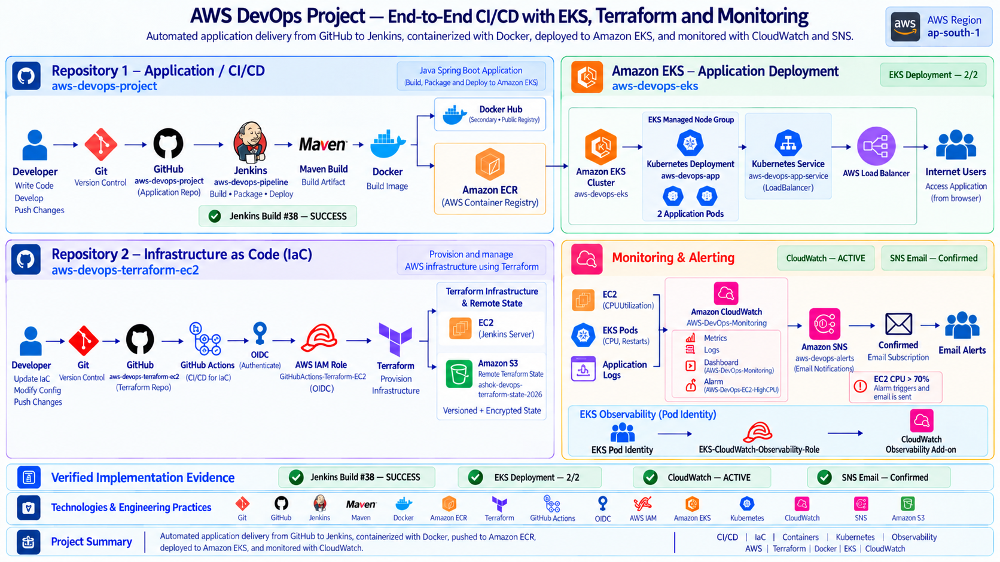

# AWS DevOps Project — End-to-End CI/CD with Amazon EKS

A complete AWS DevOps portfolio project that automates application delivery from GitHub through Jenkins, Maven, Docker, Amazon Elastic Container Registry (ECR), and Amazon Elastic Kubernetes Service (EKS).

The project also includes infrastructure automation with Terraform and GitHub Actions using OpenID Connect (OIDC), plus observability with Amazon CloudWatch and Amazon Simple Notification Service (SNS).

## Project Overview

This is one end-to-end DevOps project implemented across two GitHub repositories.

### Repository 1 — Application / CI-CD

**Repository:** `aws-devops-project`

Responsible for:
- Java Spring Boot application
- Jenkins CI/CD pipeline
- Maven application packaging
- Docker image creation
- Docker Hub publishing
- Amazon ECR publishing
- Amazon EKS deployment
- Kubernetes manifests
## Jenkins CI/CD

**Jenkins Job:** `aws-devops-pipeline`

Jenkins runs in Docker on an EC2 server and is triggered automatically by GitHub pushes.

### Pipeline Stages

```text
Build
   →
   Terraform Validate & Plan
   →
   Docker Build 
   →
   Docker Push - Docker Hub
	→
   ECR Login
	→
   Docker Push - ECR
   →
	   Deploy to EKS
```


### Latest Verified Build

Build #38 — SUCCESS

### Maven Build

The pipeline uses:

```bash
mvn clean package -DskipTests
```

The current pipeline therefore performs application build and packaging without executing automated tests.

## Container Registry

### Docker Hub

```text
ashokcsdev/aws-devops-project:latest
```

Docker Hub is used as a `Secondary Public Registry` .

### Amazon ECR

```text
839084984521.dkr.ecr.ap-south-1.amazonaws.com/aws-devops-project:latest
```

Amazon ECR is the `Primary Deployment Registry`.

The Kubernetes deployment manifest and the running EKS deployment have been verified to use this ECR image.

### Deployment Path

```text
Jenkins
   →
   Docker Build
   ↓
Amazon ECR
   ↓
Amazon EKS
```
### Cluster

- **Cluster:** `aws-devops-eks`
- **Region:** `ap-south-1`
- **Status:** ACTIVE

### Kubernetes Deployment

- **Deployment:** `aws-devops-app`
- **Replicas:** 2
- **Verified state:** 2/2 Ready, 2 Available

The Kubernetes deployment uses the Amazon ECR image:

```text
839084984521.dkr.ecr.ap-south-1.amazonaws.com/aws-devops-project:latest
```

### Kubernetes Service

- **Service:** `aws-devops-app-service`
- **Type:** LoadBalancer
- **Port mapping:** `80 → 8080`

The application is exposed through an AWS Load Balancer and was verified from a browser with:

```text
AWS DevOps Application is Running!
```

### Kubernetes Health and Resources

The deployment includes:

- Readiness probe
- Liveness probe

**Resource requests**

```text
CPU: 100m
Memory: 256Mi
```

**Resource limits**

```text
CPU: 500m
Memory: 512Mi
```

## Terraform Integration in CI/CD

Repository 1 also contains a compact Terraform configuration under `terraform/`.

This configuration is used by the Jenkins pipeline for validation and planning:

- `terraform init`
- `terraform fmt -check`
- `terraform validate`
- `terraform plan`

The Jenkins pipeline does not run `terraform apply` for this Repository 1 configuration.

## Infrastructure as Code

Infrastructure automation is maintained in the second repository:

`aws-devops-terraform-ec2`

The infrastructure workflow uses GitHub Actions, GitHub OpenID Connect (OIDC), AWS Identity and Access Management (IAM), and Terraform.
### GitHub Actions and OpenID Connect

The infrastructure repository uses GitHub Actions for Terraform automation.

The authentication flow is:

```text
GitHub
   ↓
GitHub Actions
   ↓
GitHub OpenID Connect (OIDC)
   ↓
AWS IAM Role
   ↓
Terraform
   ↓
AWS Infrastructure
```

AWS IAM role used by the GitHub Actions workflow:

`GitHubActions-Terraform-EC2`

GitHub OIDC is used instead of long-lived AWS access keys for the Terraform workflow.

### Terraform Remote State

Terraform remote state is stored in Amazon S3.

**S3 bucket:**

`ashok-devops-terraform-state-2026`

Verified state protections:
- Versioning enabled
- Encryption enabled
- Public access blocked

## Repository 2 Summary

**Repository:** `aws-devops-terraform-ec2`

This repository contains the Terraform infrastructure configuration and the GitHub Actions workflow used for infrastructure automation.
## CloudWatch Observability

EKS observability is integrated using the Amazon CloudWatch observability add-on.

**Add-on:** `amazon-cloudwatch-observability`
**Status:** `ACTIVE`
**Health issues:** `[]`

### EKS Pod Identity

The CloudWatch observability workflow uses EKS Pod Identity.

```text
EKS Pod Identity
   ↓
EKS-CloudWatch-Observability-Role
   ↓
CloudWatch Observability Add-on
```

CloudWatch role: `EKS-CloudWatch-Observability-Role`

Policy: `CloudWatchAgentServerPolicy`

### CloudWatch Logs

Verified log groups:

- `/aws/containerinsights/aws-devops-eks/application`
- `/aws/containerinsights/aws-devops-eks/dataplane`
- `/aws/containerinsights/aws-devops-eks/host`
- `/aws/containerinsights/aws-devops-eks/performance`

Application log streams have been verified for `aws-devops-app`.

### CloudWatch Dashboard

Dashboard: `AWS-DevOps-Monitoring`

Current monitoring views include:
- EC2 CPU utilization
- EKS pod CPU utilization
- Pod/container restart count
- EC2 High CPU alarm status

### CloudWatch Alarm and SNS

Alarm:

- **Name:** `AWS-DevOps-EC2-HighCPU`
- **Metric:** `CPUUtilization`
- **Threshold:** `70%`
- **Period:** `5 minutes`
- **Verified state:** `OK`

SNS topic: `aws-devops-alerts`

Email subscription: `Confirmed`

```text
CloudWatch Alarm
   ↓
Amazon SNS
   ↓
Confirmed Email Subscription
```
## Security and Access Control

The project uses AWS Identity and Access Management (IAM) roles for CI/CD and infrastructure automation.

### GitHub Actions Authentication

- GitHub Actions uses OpenID Connect (OIDC) for AWS authentication.
- No long-lived AWS access keys are used by the Terraform workflow.
- IAM role: `GitHubActions-Terraform-EC2`

### Jenkins and EKS Access

- Jenkins uses an AWS IAM role for AWS and Amazon EKS access.
- EKS access for Jenkins is namespace-scoped.
- Broad cluster-level EKS access was not retained for the CI role.

### IAM Permission Hardening

- `AdministratorAccess` was removed from the project role.
- Scoped IAM permissions were used for the required CI/CD and infrastructure operations.
## Verified Implementation Evidence

The following implementation evidence was verified during the project:

- **Jenkins Build #38:** SUCCESS
- **Amazon EKS Deployment:** `aws-devops-app` verified at 2/2 Ready and 2 Available
- **Amazon ECR:** ECR image verified as the running application image
- **CloudWatch:** `amazon-cloudwatch-observability` add-on ACTIVE with no health issues
- **CloudWatch Dashboard:** `AWS-DevOps-Monitoring`
- **CloudWatch Alarm:** `AWS-DevOps-EC2-HighCPU` verified in OK state
- **Amazon SNS:** `aws-devops-alerts` with confirmed email subscription
- **Live Application:** `AWS DevOps Application is Running!` verified through the AWS Load Balancer endpoint
## Technologies and Engineering Practices

### Technologies

- Git
- GitHub
- Jenkins
- Maven
- Docker
- Docker Hub
- Amazon Elastic Container Registry (ECR)
- Terraform
- GitHub Actions
- OpenID Connect (OIDC)
- AWS Identity and Access Management (IAM)
- Amazon Elastic Kubernetes Service (EKS)
- Kubernetes
- Amazon CloudWatch
- Amazon Simple Notification Service (SNS)
- Amazon S3

### Engineering Practices

CI/CD | Infrastructure as Code | Containers | Kubernetes | Observability | IAM | Remote State | Cloud Automation
## Roadmap and Future Improvements

The current implementation is functional and verified. The following improvements are planned for a future iteration:

- Add automated unit/integration tests and make test execution a CI quality gate.
- Add Infrastructure as Code and container image security scanning using tools such as Checkov, tfsec, or Trivy.
- Evaluate a GitOps deployment model using Argo CD or Flux instead of direct Jenkins-to-cluster deployment.
- Introduce separate staging and production environments.
- Demonstrate Kubernetes autoscaling using a Horizontal Pod Autoscaler (HPA).
## Repository Links

### Application and CI/CD

- [aws-devops-project](https://github.com/ashokcsdev/aws-devops-project)

### Infrastructure as Code

- [aws-devops-terraform-ec2](https://github.com/ashokcsdev/aws-devops-terraform-ec2)


